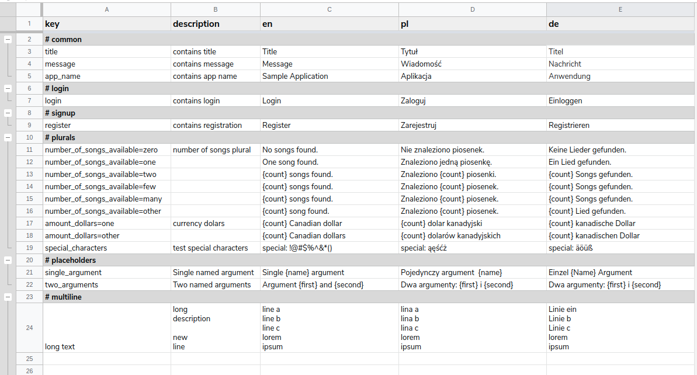

# Import translations from Google Sheets 

[](https://pub.dartlang.org/packages/gsheet_to_arb)


- Import [Application Resource Bundle](https://github.com/googlei18n/app-resource-bundle/wiki/ApplicationResourceBundleSpecification) (ARB) from Google Sheets
- automatically create Dart [intl](https://pub.dev/packages/intl) classes
- group translations by categories (context) 
- supports placeholders and plurals

## Usage

### Import Translation files from the Google Sheet

1. [Setup](#setup) plugin configuration yaml file (you only need to do it once.)

2. Import ARB and Dart source files from the Google Sheet

    ```
    pub run gsheet_to_arb:import
    ```
    or for flutter

    ```
    flutter pub run gsheet_to_arb:import
    ```

  


## Setup

### 1. Create translation spreadsheet based on the [template](https://docs.google.com/spreadsheets/d/1CwFRjtiCmCl8yvP55yBT70h-Yt00CcigD816hsGo7KU/edit?usp=sharing)


- Copy the template to your Drive account - `File -> Make a copy`

- Save `DOCUMENT_ID` of your spreadsheet *https://docs.google.com/spreadsheets/d/DOCUMENT_ID/edit#gid=0*

- For more details about spreasheet structure see [Spreadsheet format](#Spreadsheet-format) section

### 2. Create [Google Sheets API credentials](doc/Authentication.md) either by using Client or Server authentication.

### 3. Configure your Dart project

1. Add gsheet_to_arb dev dependency to the pubspec.yaml
    ```yaml
    dev_dependencies:
      gsheet_to_arb: ^0.1.4
    ```

2. Updated dependencies
    ```pub update```

3. Create plugin configuration
    ```yaml
    pub run gsheet_to_arb:import --create-config
    ```
- It will add plugin configuration to the `pubspec.yaml` file and create `gsheet_to_arb.yaml` authentication file for the gsheet credentials

4. Update plugin configuration created in ```pubspec.yaml``` e.g.
    ```yaml
    gsheet_to_arb: 
        arb_file_prefix: 'intl' # suffix of the created arb files e.g. intl_en.arb
        localization_file_name: 'l10n' # Genrated intl dart file name e.g. L10n.dart
        output_directory: 'lib/l10n' # where all the dart and arb data are stored
        add_context_prefix: false # should add category prefix to the keys e.g. common_app_title
        gsheet: 
            auth_file: './gsheet_to_arb.yaml' # file with the gsheet authentication configuration
            category_prefix: "# " 
            document_id: 'TODO'
            sheet_id: '0'
    ```

5. Update gsheet authentication configuration created in ```gsheet_to_arb.yaml```
- either add client
    ```yaml
    oauth_client_id: 
        client_id: "TODO"
        client_secret: "TODO"
    ```
- or server credentials
    ```yaml
    service_account_key: 
        client_id: "TODO"
        client_email: "TODO"
        private_key: "TODO"
    ```
---   

## Spreadsheet format

### Rows

- the first row is reserved for the header section and contains label of the related columns
- other rows
    - if rows start with the `category_prefix` value (`# ` default) all the following rows will use the category as a context (see: ARB context, and `add_context_prefix` parameter)
    - empty rows are ignored

### Columns

- the first column contains eiter key name or category prefix
- the second column contains item description
- all the following column contains traslation files
- make sure spreadsheet contains only valid colums - i.e. with langauge key value

### Values
- Placeholder 
    - simply add `{placeholder_name}` to the translation

- Plurals
    - plurals are identified by the key metadata - if key ends with one of the following
        - zero, one, two, few, many, other - it's considered as a plural
        - plural use special placeholder `{count}` to mark value provied as a translation parameter

## TODO
- support placeholder parameter types (e.g. int, date, text, double) - {items, int}

